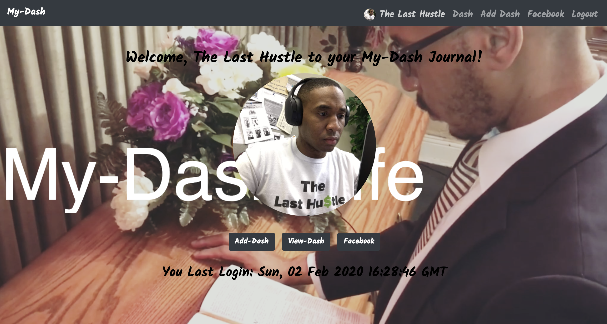

This project was bootstrapped with [Create React App](https://github.com/facebook/create-react-app).
<!-- 
## Available Scripts

In the project directory, you can run:

### `npm start`

Runs the app in the development mode. 
Open [http://localhost:3000](http://localhost:3000) to view it in the browser.

The page will reload if you make edits. 
You will also see any lint errors in the console.

### `npm test`

Launches the test runner in the interactive watch mode. 
See the section about [running tests](https://facebook.github.io/create-react-app/docs/running-tests) for more information.

### `npm run build`

Builds the app for production to the `build` folder. 
It correctly bundles React in production mode and optimizes the build for the best performance.

The build is minified and the filenames include the hashes. 
Your app is ready to be deployed!

See the section about [deployment](https://facebook.github.io/create-react-app/docs/deployment) for more information.

### `npm run eject`

**Note: this is a one-way operation. Once you `eject`, you can’t go back!**

If you aren’t satisfied with the build tool and configuration choices, you can `eject` at any time. This command will remove the single build dependency from your project.

Instead, it will copy all the configuration files and the transitive dependencies (Webpack, Babel, ESLint, etc) right into your project so you have full control over them. All of the commands except `eject` will still work, but they will point to the copied scripts so you can tweak them. At this point you’re on your own.

You don’t have to ever use `eject`. The curated feature set is suitable for small and middle deployments, and you shouldn’t feel obligated to use this feature. However we understand that this tool wouldn’t be useful if you couldn’t customize it when you are ready for it.

## Learn More

You can learn more in the [Create React App documentation](https://facebook.github.io/create-react-app/docs/getting-started).

To learn React, check out the [React documentation](https://reactjs.org/).

### Code Splitting

This section has moved here: https://facebook.github.io/create-react-app/docs/code-splitting

### Analyzing the Bundle Size

This section has moved here: https://facebook.github.io/create-react-app/docs/analyzing-the-bundle-size

### Making a Progressive Web App

This section has moved here: https://facebook.github.io/create-react-app/docs/making-a-progressive-web-app

### Advanced Configuration

This section has moved here: https://facebook.github.io/create-react-app/docs/advanced-configuration

### Deployment

This section has moved here: https://facebook.github.io/create-react-app/docs/deployment

### `npm run build` fails to minify

This section has moved here: https://facebook.github.io/create-react-app/docs/troubleshooting#npm-run-build-fails-to-minify -->

# My-Dash
Application Overview
My-Dash is a legacy journal based CRUD application that allows users to save their life events. Users can add a new event entry, edit an entry, view all entries, and delete a entry.

# Installation Instructions
- Clone down this repo https://github.com/rarceneaux/my-dash-capstone
- At the root of the project, run npm install
- Create a project in Firebase
- Add a web app to the project and enable Google authentication
- Create a real-time database and seed it with the data from the database directory
- Create a file named /helpers/data/apiKeys.json and add your Firebase keys using the apiKeys.example.json as a template *Make sure your apiKeys are added into your .gitignore file

# How to Run My-Dash
In your terminal, type npm start
Note: if you want to make a production build of this project, type npm run build. This will create a folder called build with all the minified code you need.

# How to Deploy My-Dash
In your terminal, type npm run deploy

# Application Features
Once you login with your google email account:
- User can create an event entry with a title, summary, and entry photo
- User can edit an existing entry by changing one or all fields (title, summary, photo)
- User can delete an event entry entirely from their journal
- User can share My-Dash App on Facebook

# My-Dash Screenshot
LOGIN

GMAIL POPUP

HOME PAGE

READ

ADD NEW EVENT FORM

EDIT EVENT FORM

FACEBOOK SHARE 

# VISIT ONLINE:
my-dash-93e26.firebaseapp.com
